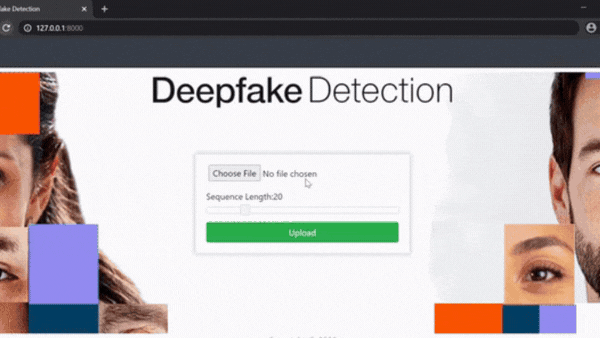

# AI-Powered Video Deepfake Detection System

<div align="center">


**Advanced Deep Learning System for Detecting Video Deepfakes**

*Developed by Mostafa Anwar*

[Features](#features) • [Demo](#demo) • [Installation](#installation) • [Usage](#usage) • [Model Performance](#model-performance) • [Documentation](#documentation)

</div>

---

## 📋 Table of Contents

- [Overview](#overview)
- [Features](#features)
- [Demo](#demo)
- [System Architecture](#system-architecture)
- [Model Performance](#model-performance)
- [Installation](#installation)
- [Usage](#usage)
- [Project Structure](#project-structure)
- [Technologies Used](#technologies-used)
- [Documentation](#documentation)
- [Future Enhancements](#future-enhancements)
- [Author](#author)
- [License](#license)

---

## 🎯 Overview

This project aims to detect video deepfakes using state-of-the-art deep learning techniques combining **ResNext CNN** and **LSTM** networks. The system achieves deepfake detection through transfer learning, where a pretrained ResNext CNN extracts feature vectors from video frames, which are then processed by an LSTM layer for temporal analysis and classification.

### 🔑 Key Highlights

- **93.58% Accuracy** on 100-frame analysis
- **Real-time Detection** with adjustable frame sequences
- **Web-based Interface** built with Django
- **Face Detection & Tracking** using advanced computer vision
- **Dockerized Application** for easy deployment

---

## ✨ Features

### 🎥 Video Analysis
- Upload and analyze videos in MP4, AVI, and MOV formats
- Adjustable frame sequence length (10, 20, 40, 60, 80, 100 frames)
- Real-time face detection and tracking
- Visual frame-by-frame analysis

### 🧠 AI/ML Capabilities
- **ResNext-50** CNN for spatial feature extraction
- **LSTM** for temporal sequence analysis
- Transfer learning from ImageNet
- Multiple pre-trained models for different accuracy-speed tradeoffs

### 🎨 Modern Web Interface
- Beautiful gradient UI with smooth animations
- Responsive design for all devices
- Real-time prediction visualization
- Detailed analysis results with confidence scores

### 🐳 Deployment Ready
- Dockerized application
- Easy setup with one-command deployment
- GPU and CPU support
- Production-ready configuration

---

## 🎬 Demo

### Application Interface

<div align="center">
  
  <p><i>Real-time video deepfake detection in action</i></p>
</div>

### System Architecture

<div align="center">
  
  <p><i>Complete system architecture showing the detection pipeline</i></p>
</div>

---

## 📊 Model Performance

Our models have been trained and tested on diverse datasets with impressive results:

| Model Name | Videos | Frames | Accuracy |
|------------|--------|--------|----------|
| model_84_acc_10_frames_final_data.pt | 6000 | 10 | **84.21%** |
| model_87_acc_20_frames_final_data.pt | 6000 | 20 | **87.79%** |
| model_89_acc_40_frames_final_data.pt | 6000 | 40 | **89.35%** |
| model_90_acc_60_frames_final_data.pt | 6000 | 60 | **90.59%** |
| model_91_acc_80_frames_final_data.pt | 6000 | 80 | **91.50%** |
| model_93_acc_100_frames_final_data.pt | 6000| 100| **93.59%** |

> 💡 **Note:** Higher frame counts provide better accuracy but require more processing time. Choose based on your speed-accuracy requirements.

---

## 🚀 Installation

### Prerequisites

- Python 3.8 or higher
- pip package manager
- (Optional) CUDA-capable GPU for faster processing

### Option 1: Local Installation

1. **Clone the repository**
   ```bash
   git clone https://github.com/YOUR_USERNAME/Deepfake_detection_using_deep_learning.git
   cd Deepfake_detection_using_deep_learning
   ```

2. **Create virtual environment**
   ```bash
   python -m venv venv
   
   # Windows
   venv\Scripts\activate
   
   # Linux/Mac
   source venv/bin/activate
   ```

3. **Install dependencies**
   ```bash
   cd "Django Application"
   pip install -r requirements.txt
   ```

4. **Download pre-trained models**
   - Download models from [Google Drive](https://drive.google.com/drive/folders/1UX8jXUXyEjhLLZ38tcgOwGsZ6XFSLDJ-?usp=sharing)
   - Place them in `Django Application/models/` directory

5. **Run the application**
   ```bash
   python manage.py runserver
   ```

6. **Access the application**
   - Open your browser and navigate to: `http://127.0.0.1:8000/`

### Option 2: Docker Installation (Recommended)

```bash
# Pull and run the application
docker run --rm --gpus all -v static_volume:/home/app/staticfiles/ \
  -v media_volume:/app/uploaded_videos/ \
  --name=deepfakeapplication YOUR_DOCKER_IMAGE

# Run Nginx proxy
docker run -p 80:80 --volumes-from deepfakeapplication \
  -v static_volume:/home/app/staticfiles/ \
  -v media_volume:/app/uploaded_videos/ YOUR_NGINX_IMAGE
```

Access at: `http://localhost:80`

---

## 💻 Usage

### Web Interface

1. **Upload Video**
   - Click the upload area or drag & drop your video file
   - Supported formats: MP4, AVI, MOV

2. **Select Frame Sequence**
   - Use the slider to choose number of frames (10-100)
   - More frames = Higher accuracy but slower processing

3. **Analyze**
   - Click "Analyze Video" button
   - Wait for processing (typically 10-30 seconds)

4. **View Results**
   - See prediction: REAL or FAKE
   - Check confidence score
   - Review analyzed frames
   - View detected faces

### Command Line (Model Training)

```bash
cd "Model Creation"
jupyter notebook
# Open Model_and_train_csv.ipynb
# Follow the steps in the notebook
```

---

## 📁 Project Structure

```
Deepfake_detection_using_deep_learning/
│
├── Django Application/          # Web application
│   ├── ml_app/                 # Main Django app
│   │   ├── views.py           # Core detection logic
│   │   ├── forms.py           # Upload forms
│   │   └── templates/         # HTML templates
│   ├── models/                # Pre-trained model files
│   ├── static/                # CSS, JS, assets
│   ├── uploaded_videos/       # Temporary video storage
│   └── manage.py              # Django management
│
├── Model Creation/            # Training notebooks
│   ├── Model_and_train_csv.ipynb
│   ├── preprocessing.ipynb
│   └── Predict.ipynb
│
├── Documentation/             # Research papers & docs
│   ├── Project Report.pdf
│   └── IJSRDV8I10860.pdf
│
├── github_assets/            # Demo images & GIFs
│   ├── fakegif.gif
│   └── System Architecture.png
│
├── LICENSE
└── README.md
```

---

## 🛠️ Technologies Used

### Deep Learning & AI
- **PyTorch** - Deep learning framework
- **TorchVision** - Computer vision models
- **ResNext-50** - Feature extraction
- **LSTM** - Temporal analysis

### Web Framework
- **Django 5.0+** - Web framework
- **HTML/CSS/JavaScript** - Frontend
- **Bootstrap** - UI components
- **Font Awesome** - Icons

### Computer Vision
- **OpenCV** - Video processing
- **face-recognition** - Face detection
- **dlib** - Facial landmarks
- **Pillow** - Image processing

### Data Science
- **NumPy** - Numerical computing
- **Pandas** - Data manipulation
- **Matplotlib** - Visualization
- **scikit-learn** - ML utilities

### Deployment
- **Docker** - Containerization
- **Nginx** - Web server
- **Gunicorn** - WSGI server

---

## 📚 Documentation

Detailed documentation is available in the `Documentation/` folder:

- **Project Report.pdf** - Complete project documentation
- **Research Paper (IJSRDV8I10860.pdf)** - Published research paper
- **Model Creation/** - Jupyter notebooks with training details

---

## 🔮 Future Enhancements

- [ ] Deploy to cloud platforms (AWS, Azure, GCP)
- [ ] Create REST API for third-party integration
- [ ] Batch video processing capability
- [ ] Real-time webcam deepfake detection
- [ ] Mobile application (iOS & Android)
- [ ] Support for additional video formats
- [ ] Enhanced UI with more visualizations
- [ ] Multi-language support

### ✅ Completed Features
- [x] Dockerized application
- [x] Support for non-CUDA systems
- [x] Modern, responsive UI
- [x] Multiple model options
- [x] Face detection and tracking

---

## 👨‍💻 Author

**Mostafa Anwar**

- 📧 Email: sagorahmed1400@gmail.com


> *This project was developed as part of my internship work, focusing on leveraging deep learning for deepfake detection.*

---

## 📄 License

This project is licensed under the **GNU General Public License v3.0** - see the [LICENSE](LICENSE) file for details.

```
Copyright (C) 2026 Mostafa Anwar

This program is free software: you can redistribute it and/or modify
it under the terms of the GNU General Public License as published by
the Free Software Foundation, either version 3 of the License, or
(at your option) any later version.
```

---

## 🙏 Acknowledgments

- Thanks to the open-source community for amazing tools and libraries
- Inspired by research in deepfake detection and computer vision
- Built with ❤️ using state-of-the-art AI technology

---

## ⭐ Show Your Support

If you find this project useful, please consider:

- ⭐ **Starring** this repository
- 🍴 **Forking** to contribute
- 📢 **Sharing** with others
- 🐛 **Reporting** issues

---

<div align="center">

**[⬆ Back to Top](#ai-powered-video-deepfake-detection-system)**

Made with 🧠 and ☕ by **Mostafa Anwar** | 2026

*Powered by Advanced AI & Deep Learning*

</div>


